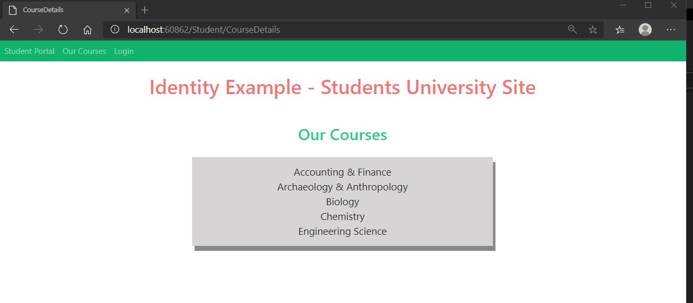

# Tareas del MOC

## Module 11: Managing Security

# Lesson 2: Authorization in ASP.NET Core

### Demonstration: How to Authorize Access to Controller Actions

- Instalamos las dependencias desde la consola

- Completamos el middleware para que acepte la autenticacion por roles

- En el StudentController inllectamos la dependencia  y creamos la accion Coursedetails que pèrmite acceder de forma anonima

- EJecutamos

  

